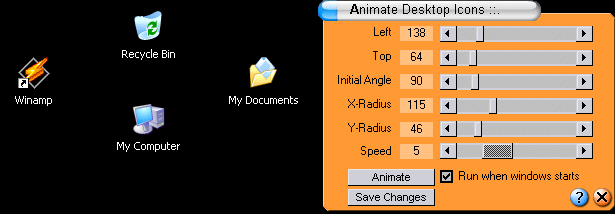



## Desktop Icon Animation \(updated\)

### Description

Amazing animation on your desktop icons by positioning them in an geometrical ellipse.[ I did few update like rotation times and save changes confirmation etc]. It also remembers the settings you give it to. People who have more than 10 icons on their desktop, actually should not use it. Little bit of geometry involved here but easy. Compile and be amazed what API's can do.Vote or Email me if you've liked my work. One more thing - PLEASE PLEASE read the "readme.txt" file in the package.
 
### More Info
 

             |
---                |---
**Submitted On**   |2004-06-14 15:36:22
**By**             |[Mahbubur Rahman \(Pappu\)](https://github.com/Planet-Source-Code/PSCIndex/blob/master/ByAuthor/mahbubur-rahman-pappu.md)
**Level**          |Intermediate
**User Rating**    |4.0 (20 globes from 5 users)
**Compatibility**  |VB 5\.0, VB 6\.0
**Category**       |[Windows API Call/ Explanation](https://github.com/Planet-Source-Code/PSCIndex/blob/master/ByCategory/windows-api-call-explanation__1-39.md)
**World**          |[Visual Basic](https://github.com/Planet-Source-Code/PSCIndex/blob/master/ByWorld/visual-basic.md)
**Archive File**   |[Desktop\_Ic1757286142004\.zip](https://github.com/Planet-Source-Code/mahbubur-rahman-pappu-desktop-icon-animation-updated__1-53877/archive/master.zip)

